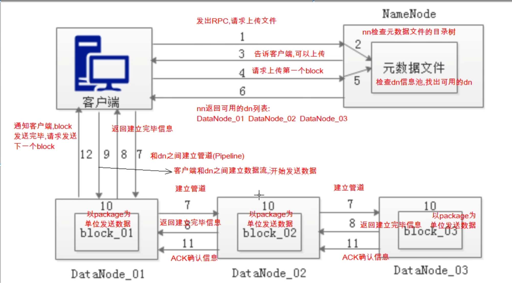
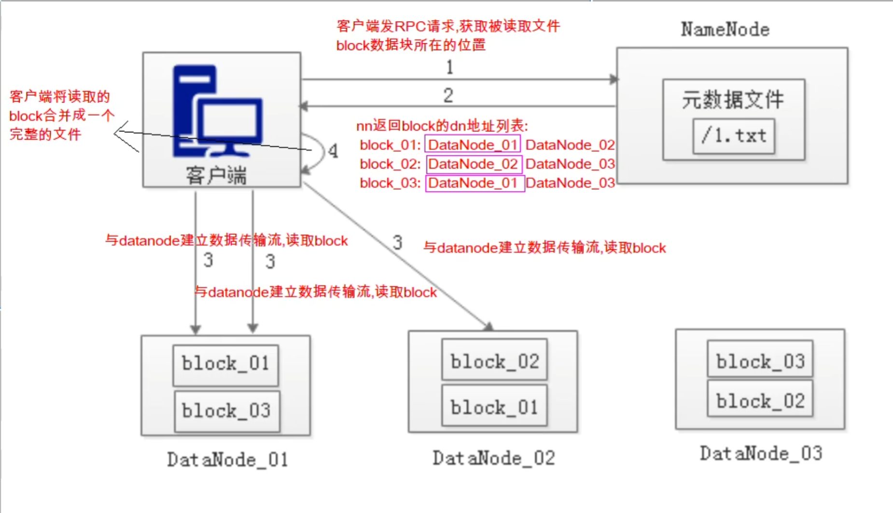

OnXxx 通常表示“当 Xxx 事件发生时执行”，大多是回调/事件处理函数，但本质上只是命名约定，真正是否为回调要看它有没有被注册或异步触发。

SSTable 是 Sorted String Table 的缩写，意思是“有序字符串表”。
在 LSM-Tree / LevelDB / RocksDB 这类存储系统里，SSTable 通常指一种磁盘上的不可变有序文件：
里面存的是很多 key-value 数据
数据按 key 排好序
文件写好之后一般不再原地修改
查询时可以通过索引、布隆过滤器、块偏移等方式快速定位
后台会通过 compaction 把多个 SSTable 合并、清理旧版本数据

在 LSM-tree(Log Structured Merge Tree) 数据库里，通常会有两种 MemTable：
1. active memtable      当前正在接收写入的 MemTable
2. immutable memtable   已经冻结、不再接收写入、等待刷盘的 MemTable
为什么需要它？因为 MemTable 满了以后要刷成 SSTable。如果直接拿当前 MemTable 去刷盘，同时还继续写入，就会有并发问题：
线程 A 正在遍历 MemTable 写 SSTable，线程 B 又 Put/Delete 修改 MemTable，这样刷出来的数据可能不一致。
所以常见做法是：
1. 当前 memtable 写满
2. 把它标记为 immutable memtable，不再允许修改
3. 新建一个 active memtable，后续写入进入新的 memtable
4. 后台线程慢慢把 immutable memtable 刷成 SSTable
5. 刷盘完成后释放 immutable memtable
immutable 的好处是：刷盘时数据稳定。不用长时间阻塞新写入。迭代器遍历更安全

布隆过滤器
有不一定有，但是没有一定没有

epoll_event 是 Linux epoll 机制里用来描述“某个 fd 关心什么事件 / 发生了什么事件”的结构体
struct epoll_event {
    uint32_t events;  // 事件类型，比如 EPOLLIN、EPOLLOUT
    epoll_data_t data; // 用户自定义数据，常用来存 fd 或指针
};
events 字段表示事件类型：
EPOLLIN   // 可读
EPOLLOUT  // 可写
EPOLLERR  // 错误
EPOLLHUP  // 对端关闭或挂起
EPOLLET   // 边缘触发模式

为什么要设置 SO_REUSEADDR？
服务器程序经常绑定一个固定端口，比如：0.0.0.0:9000。如果服务器刚退出又马上重启，端口可能还处于 TIME_WAIT 等状态。没有 SO_REUSEADDR 时，bind() 可能失败，报：Address already in use。设置后，通常可以更快重新启动服务并绑定同一个端口。

.join()：等待线程结束
当前线程会阻塞，直到目标线程运行完毕。
.detach()：让线程独立运行
当前线程不再等待，也无法再通过该 std::thread 对象控制或等待它。
一个可运行的 std::thread 在析构前必须调用 join() 或 detach() 其中之一；否则程序会调用 std::terminate()。线程池通常应使用 join()，而不是 detach()。

边缘触发 ET 模式必须非阻塞
如果用 EPOLLET，事件只在状态变化时通知一次。常见写法是：
while (true) {
    ssize_t n = read(fd, buf, sizeof(buf));
    if (n > 0) {
        // 处理数据
    } else if (n == -1 && errno == EAGAIN) {
        break; // 已经读干净了
    } else {
        // 关闭或错误
    }
}
这里必须靠非阻塞的 EAGAIN 判断“读到尽头”。如果是阻塞 fd，循环最后一次 read 会直接挂住。

为什么进程上下文切换更“重”？
因为进程有独立的虚拟地址空间。切换进程时，CPU 不只是换一组寄存器，还可能要换页表。
页表一换，之前缓存的虚拟地址到物理地址的映射，也就是 TLB，可能失效。后续访问内存时，需要重新建立映射，性能会受影响。
线程如果在同一个进程内切换，则共享地址空间，页表不用换，所以一般更轻。

select、poll、epoll的区别是什么

#### 客户端上传文件流程

#### 客户端读取文件流程

Raft 选举流程大概是：
follower 长时间没收到 leader 心跳。
它认为 leader 可能挂了。
它把自己变成 candidate。
current_term_++，进入新任期。
先投票给自己。
向其他节点发送 RequestVote。
收到多数票后，成为 leader。

在 Raft 里，客户端提交写请求时，leader 会：
把命令追加到本地日志。
发给 follower 复制。
等待多数节点复制成功。
日志变成 committed。
唤醒正在等待的客户端线程。

当前实现存在的问题：

HANameNodeServer::ApplyAllocateBlock
这里有个设计细节：它依赖当前节点本地的 dn_manager_ 存活 DataNode 状态。
如果不同 NameNode 上看到的 alive DataNode 不一致，理论上可能导致各节点 apply 出来的 block locations 不一致。
课程项目里可能接受这个简化；严格 Raft 状态机通常要求 apply 结果完全确定。
更严谨的做法通常有几种：
1. ALLOCATE_BLOCK 时由 leader 选定 block_id 和 locations，然后把这些确定结果写进 Raft log。Follower apply 时只按日志里的结果更新 metadata，不再本地重新选择 DataNode。

2. 把 DataNode 注册、心跳状态、可用空间等也纳入 Raft 状态机，让所有 NameNode 的 dn_manager_ 一致。不过心跳频繁，这样成本比较高。

3. 只有 leader 处理分配，follower 不根据本地 dn_manager_ 做决策；follower 只 replay leader 已经决定好的 block 分配结果。

对这个项目来说，最自然的是第 1 种：leader 做决策，Raft log 复制决策结果，而不是复制“请你自己分配一下”这个意图。

RaftNode::Propose
正常情况下 LogEntry.index 设计上应该是递增的：entry.index = log_.back().index + 1;
但这里有一个潜在 bug：快照裁剪后，代码保留的是 log_[0] 这个哨兵日志，它的 index 仍然是 0
这时再 Propose，新日志会被分配成 1，就不是全局递增了。
当前代码意图上 LogEntry.index 是递增的；在没有快照裁到只剩哨兵日志时也是递增的。
但快照后只剩 dummy log 的场景下，Propose() 用 log_.back().index + 1 会导致 index 回退，
应该改成基于 max(log_.back().index, snapshot_last_index_) + 1 更稳。

HANameNodeServer::RestoreMetadataSnapshot
这个函数只追加/覆盖 snapshot 里的 block 和 file，但没有看到它先清空整个 metadata_。如果恢复前 metadata_ 里存在 snapshot 中没有的旧文件或旧 block，可能会残留。严格实现里通常需要先清空 metadata，再完整恢复。